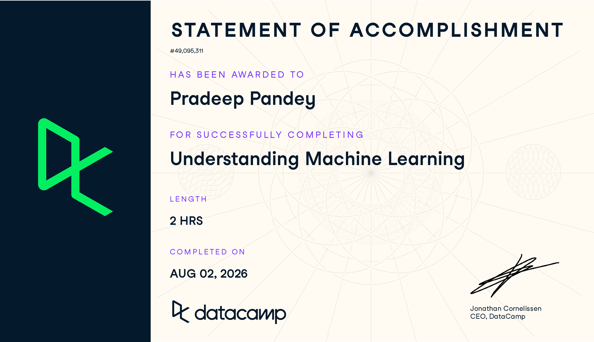
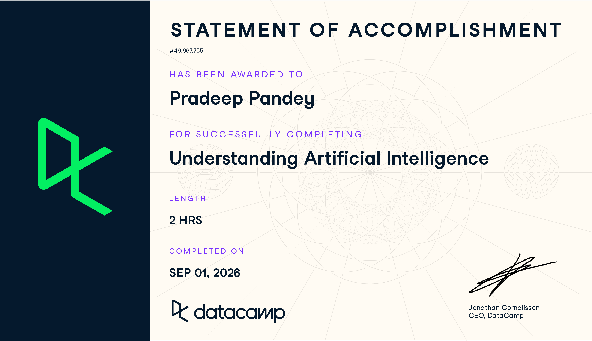
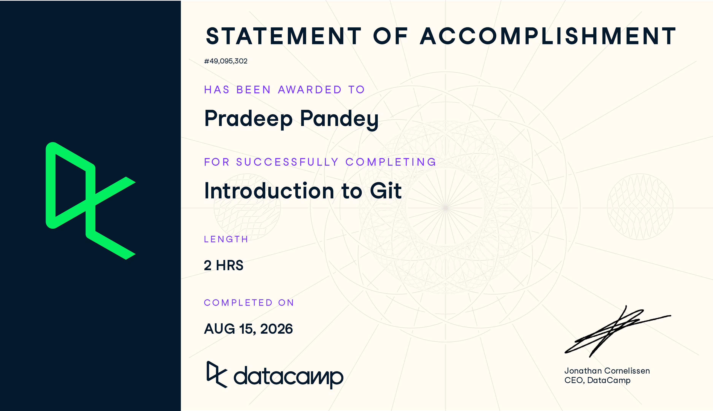

# 📜 AI & ML Certifications & Achievements

## 🔍 Overview

A collection of my certifications, workshops, hackathons, and achievements in **AI, Machine Learning, Data Analytics, and related technologies**.

---

## 🚀 Highlights

* 🥈 **2nd Place** – Internal College Hackathon
* 🎯 **SIH 2025** – Qualified for Round 1
* 🤖 **AI & Generative AI Workshop** – IIT Delhi
* 📊 **Deloitte Data Analytics Virtual Experience**
* 🎓 **DataCamp AI & ML Certifications**

---

## 🏆 Achievements

### 🥈 Internal College Hackathon

Secured **2nd Place**.

---

### 🎯 Smart India Hackathon (SIH 2025)

Qualified for **Round 1**.

---

## 🎓 Certifications

### 🤖 Understanding Machine Learning — DataCamp

**Completed:** August 2, 2026 | **Duration:** 2 Hours

---

### 🧠 Understanding Artificial Intelligence — DataCamp

**Completed:** September 1, 2026 | **Duration:** 2 Hours

---

### 🔧 Introduction to Git — DataCamp

**Completed:** August 15, 2026 | **Duration:** 2 Hours

---

### 🤖 AI & Generative AI Workshop — Tryst 2025, IIT Delhi

---

### 📊 Deloitte Data Analytics Virtual Experience Program

---

## 🎯 Current Focus

Machine Learning • Deep Learning with PyTorch • MLOps • Model Deployment

---

## 🤝 Connect

**GitHub:** https://github.com/ken-ipynb
**LinkedIn:** https://www.linkedin.com/in/pradeep-pandey-62a582325/
