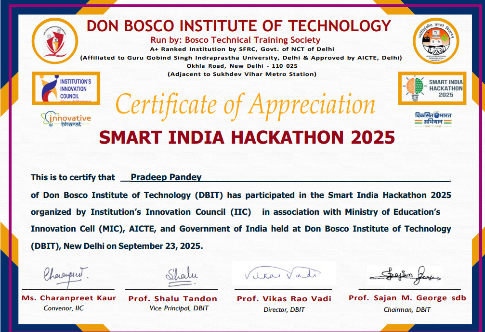
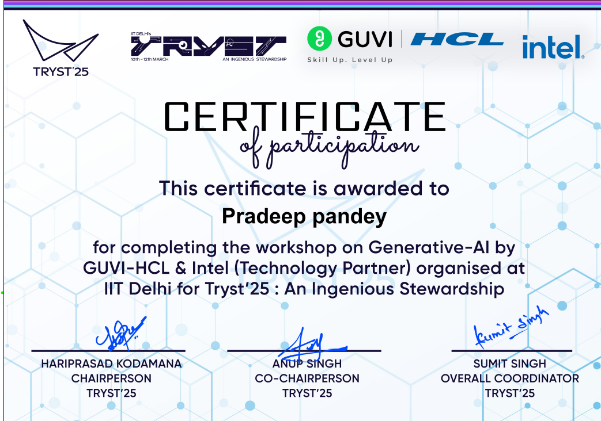

# 📜 AI & ML Certifications & Achievements

## 🔍 Overview

This repository showcases my certifications, workshops, and hackathon experiences in **Artificial Intelligence, Machine Learning, Data Analytics, and related technologies**. These experiences have helped me strengthen my technical skills, improve my problem-solving abilities, and gain practical exposure to real-world technologies and applications.

---

## 🚀 Highlights

* 🥈 **2nd Place** – Internal College Hackathon
* 🎯 **Smart India Hackathon (SIH 2025)** – Qualified for Round 1
* 🤖 **AI & Generative AI Workshop** – Tryst 2025, IIT Delhi
* 📊 **Deloitte Data Analytics Virtual Experience Program**
* 🤖 **Machine Learning & Artificial Intelligence Fundamentals** – DataCamp

---

## 🏆 Experience

### 🔹 Internal College Hackathon

* Secured **2nd Place**
* Built and presented a working solution under time constraints
* Strengthened teamwork, problem-solving, and presentation skills

📷 **Certificate**

---

### 🔹 Smart India Hackathon (SIH 2025)

* Qualified for **Round 1**
* Worked on real-world problem statements
* Gained experience in collaboration and solution design

📷 **Certificate**

---

## 🎓 Certifications

### 🔹 Understanding Machine Learning — DataCamp

* Completed an introduction to fundamental Machine Learning concepts
* Explored the core ideas and applications of Machine Learning
* ⏱️ **Duration:** 2 Hours
* 📅 **Completed:** August 2, 2026

📄 **Certificate:** [View Certificate](./Understanding_Machine_Learning_DataCamp.pdf)

---

### 🔹 Understanding Artificial Intelligence — DataCamp

* Learned fundamental concepts and applications of Artificial Intelligence
* Developed a foundational understanding of modern AI technologies
* ⏱️ **Duration:** 2 Hours
* 📅 **Completed:** September 1, 2026

📄 **Certificate:** [View Certificate](./Understanding_Artificial_Intelligence_DataCamp.pdf)

---

### 🔹 Introduction to Git — DataCamp

* Learned the fundamentals of Git and version control
* Explored essential Git workflows for managing projects
* ⏱️ **Duration:** 2 Hours
* 📅 **Completed:** August 15, 2026

📄 **Certificate:** [View Certificate](./Introduction_to_Git_DataCamp.pdf)

---

### 🔹 AI & Generative AI Workshop — Tryst 2025 (IIT Delhi)

* Learned AI, Machine Learning, and Generative AI fundamentals
* Explored practical AI applications

📷 **Certificate**

---

### 🔹 Deloitte Data Analytics Virtual Experience Program

* Developed skills in data analysis, visualization, and business insights

📷 **Certificate**

---

## 🎯 Current Focus

* Machine Learning
* Deep Learning with PyTorch
* Model Deployment
* MLflow & Weights & Biases (W&B)
* MLOps & Model Optimization

---

## 🚀 Career Goal

I'm working toward becoming a **Machine Learning Engineer** by building practical AI projects, improving my technical skills, and learning how to develop and deploy production-ready ML systems.

---

## 🤝 Connect

* **GitHub:** https://github.com/ken-ipynb
* **LinkedIn:** https://www.linkedin.com/in/pradeep-pandey-62a582325/
